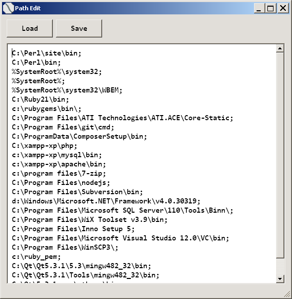

# Path Edit

## Main features

- Loads **Path Environment Variable** from the **Windows Registry**
- Saves text from the edit field to the **Path** variable and updates the environment so that new processes use the changed **Path**

## Shortcuts

- **F1** - Load Path
- **F2** - Save Path
- **Esc** - Exit
